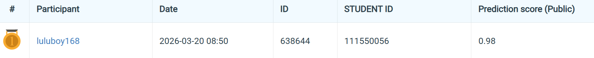

# NYCU Computer Vision 2026 HW1

* **Student ID**: 111550056
* **Name**: 陳晉祿

## Introduction
This repository contains the code for a PyTorch-based image classification pipeline using **ResNeSt-200**. The training process incorporates advanced techniques such as **Model Stock** (multi-model weight averaging), **K-Fold Cross Validation**, MixUp/CutMix augmentations, and Automatic Mixed Precision (AMP). During inference, Test-Time Augmentation (TTA) using multiscale testing and flipping is applied, along with ensembling across K-Fold models, to improve the final prediction robustness.

## Environment Setup
How to install dependencies.

```bash
pip install -r requirements.txt
```

Please place the dataset in a `data/` folder at the root of this repository (at the same level as the `codes/` directory). The scripts expect the following structure:

```text
final/
├── codes/
│   ├── train.py
│   ├── dataset.py
│   └── inference.py
├── data/
│   ├── train/
│   └── test/
├── requirements.txt
└── README.md
```

## Usage

### Training
How to train your model (supports Model Stock and K-Fold CV). You can specify the batch size, learning rate, and folds.

```bash
python codes/train.py
```

### Inference
How to run inference and generate `prediction.csv`.

```bash
python codes/inference.py
```

## Performance Snapshot

